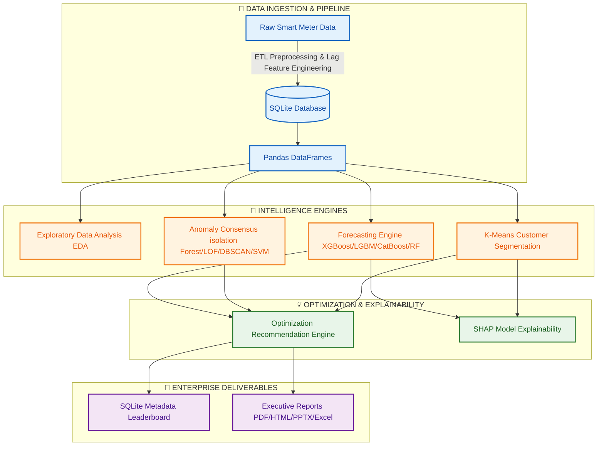

# ⚡ Autonomous Energy Optimization Platform for Smart Grids

An interactive, modular **Streamlit-powered energy analytics and predictive optimization platform** designed for smart grid operations. The platform offers end-to-end data processing, exploratory data analysis (EDA), multi-model forecasting, machine-learning-based anomaly detection, customer segmentation, recommendation engines, SHAP explainability, SQLite database persistence, and PDF/HTML/PowerPoint executive reports.

---

## 🚀 Interactive Features & Architecture



---

## 🛠️ App Navigation & Workings

Choose a tab from the Streamlit sidebar menu to navigate the grid management portal. Click on each section below to see how it works and view its interface.

<details>
<summary><b>🏠 Home Dashboard (Overview)</b></summary>

* **What it does**: Displays the dataset's top records and shows high-level descriptive statistics.
* **Database Sync**: Instantly connects to the SQLite backend database storing telemetry data.
</details>

<details>
<summary><b>📊 Dataset Loader & Preprocessing</b></summary>

* **What it does**: Ingests raw smart meter data and triggers a data cleaning and lag feature engineering pipeline.
* **Features**:
  * Outlier removal and missing value imputation.
  * Temporal feature extraction (`hour`, `day_of_week`, `is_holiday`, etc.).
  * Automated generation of lag and rolling window features for time-series forecasting.
* **Streamlit UI Demonstration**:
  <div align="center">
    
  </div>
</details>

<details>
<summary><b>📈 Exploratory Data Analysis (EDA)</b></summary>

* **What it does**: Generates beautiful, interactive Plotly visualizations stored under `reports/figs/`.
* **Included Plots**:
  * Hourly and daily consumption profiles.
  * Holiday vs. Non-holiday consumption.
  * Correlation Matrix heatmap showing relationships between lags.
  * Distribution violin plots for grid loading.
* **Pre-generated Visualizations**:
  <div align="center">
    <table>
      <tr>
        <td align="center"><b>Correlation Matrix</b><br/></td>
        <td align="center"><b>Consumption Distribution</b><br/></td>
      </tr>
      <tr>
        <td align="center"><b>Hourly Consumption</b><br/></td>
        <td align="center"><b>Hourly Boxplot</b><br/></td>
      </tr>
    </table>
  </div>
* **Streamlit UI Demonstration**:
  <div align="center">
    <br/><br/>
    
  </div>
</details>

<details>
<summary><b>🔮 Forecasting Engine</b></summary>

* **What it does**: Trains and evaluates forecasting models (Linear Regression, Random Forest, XGBoost, LightGBM, and CatBoost) on a per-consumer basis.
* **Outputs**:
  * Predicted consumption over customizable horizons (7 to 365 days).
  * Shaded 95% Confidence Intervals (CI) indicating uncertainty.
  * Peak and minimum expected load days.
* **Streamlit UI Demonstration**:
  <div align="center">
    
  </div>
</details>

<details>
<summary><b>🚨 Anomaly Detection</b></summary>

* **What it does**: Identifies grids and periods showing abnormal load profiles using multi-algorithm consensus.
* **Algorithms**:
  * **Isolation Forest**: Catches global multi-dimensional outliers.
  * **Local Outlier Factor (LOF)**: Detects local density anomalies.
  * **DBSCAN Clustering**: Labels noise points as outliers.
  * **One-Class SVM**: Finds boundary anomalies.
* **Streamlit UI Demonstration**:
  <div align="center">
    
  </div>
</details>

<details>
<summary><b>👥 Customer Segmentation</b></summary>

* **What it does**: Clusters energy consumers based on usage features (peak load, mean load, variability) to enable grid segment targeting.
* **Visuals**:
  * Segment distribution pie charts.
  * Principal Component Analysis (PCA) 2D scatter plots mapping consumer clusters.
  * Centroid Radar charts mapping load shape profiles.
* **Streamlit UI Demonstration**:
  <div align="center">
    <br/><br/>
    
  </div>
</details>

<details>
<summary><b>💡 Optimization Engine</b></summary>

* **What it does**: Correlates cluster segmentation, historical forecasts, and anomalies to trigger action-oriented recommendations.
* **Suggestions**: Demand response shifts, battery storage optimization, grid maintenance, and tariff-based shifting advice.
* **Streamlit UI Demonstration**:
  <div align="center">
    
  </div>
</details>

<details>
<summary><b>🔍 Explainability (SHAP)</b></summary>

* **What it does**: Employs **SHAP (SHapley Additive exPlanations)** values to demystify complex ML model predictions.
* **Visuals**:
  * SHAP Summary Bar chart ranking feature importances.
  * SHAP Beeswarm plot explaining directional feature impacts.
* **Streamlit UI Demonstration**:
  <div align="center">
    <br/><br/>
    
  </div>
</details>

<details>
<summary><b>🏆 Model Performance & MLflow Registry</b></summary>

* **What it does**: Logs and compares model performance metrics (MAE, MSE, RMSE, R²) directly to SQLite database and MLflow workspace.
* **Features**: Leaderboard ranking of best models for immediate production hot-swapping.
* **Streamlit UI Demonstration**:
  <div align="center">
    
  </div>
</details>

<details>
<summary><b>📑 Reports & Exporting</b></summary>

* **What it does**: Compiles results into clean corporate reports available for immediate download.
* **Formats**:
  * **HTML / PDF Reports**: Detailed metrics and figures generated on-demand.
  * **PowerPoint presentation**: Automatic slide deck compilation for board meetings.
  * **CSV / Excel sheets**: Data dumps of forecasts, anomalies, and recommendations.
* **Streamlit UI Demonstration**:
  <div align="center">
    
  </div>
</details>

---

## 💻 Setup & Local Development

### Prerequisites
* Python 3.9+
* Docker (Optional, for containerized deployments)

### Local Virtual Environment
1. **Clone & Navigate** to the workspace directory:
   ```bash
   cd energy-optimization-platform
   ```
2. **Setup virtual environment**:
   ```bash
   python -m venv .venv
   ```
3. **Activate virtual environment**:
   * **Windows Powershell**:
     ```powershell
     .venv\Scripts\Activate.ps1
     ```
   * **Linux/macOS**:
     ```bash
     source .venv/bin/activate
     ```
4. **Install dependencies**:
   ```bash
   pip install -r requirements.txt
   ```
5. **Run the Streamlit application**:
   ```bash
   streamlit run app.py
   ```

### Running with Docker
Run the entire platform in a containerized environment:
```bash
docker build -t energy-platform .
docker run -p 8501:8501 energy-platform
```
Open [http://localhost:8501](http://localhost:8501) in your browser.

---

## 📂 Project Directory Structure

```text
energy-optimization-platform/
├── app.py                      # Main Streamlit dashboard router
├── requirements.txt            # System dependencies
├── Dockerfile                  # Container definition
├── config/
│   └── settings.py             # Global constants & filepaths
├── src/
│   ├── preprocessing/          # ETL data loading & cleanup
│   ├── eda/                    # Exploratory charts & summaries
│   ├── forecasting/            # Model comparisons & forecast runs
│   ├── anomaly_detection/      # Anomaly isolation engines
│   ├── clustering/             # Customer profiling (K-Means)
│   ├── recommendation/         # Optimization suggestion logic
│   ├── explainability/         # SHAP explanation charts
│   ├── database/               # SQL operations & metadata store
│   └── reports/                # PowerPoint, PDF, HTML, & Excel generators
├── tests/                      # Pytest test cases
├── data/                       # Telemetry storage (Raw, Processed, DB)
├── models/                     # Serialized trained model pickles
└── reports/
    └── figs/                   # Cached figures (PNGs & interactive HTMLs)
```
